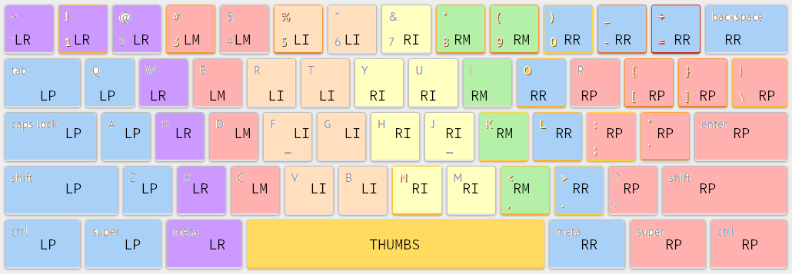

# Short Pinky Touch Typing
Advanced QWERTY touch-typing exercises for people with large hands but short pinkies.  Focusing on numbers, symbols, and brackets.

This is a NON-STANDARD fingering for QWERTY touch-typing.  I did this because my pinkies don't reach the top row.  I also find it more comfortable to use my middle fingers for an extra number key than what's standard - it helps spread the work more evenly between the fingers.

It uses standard fingering for everything except the top row (where my pinkies don't reach).  I upload this to typing.io to practice.
